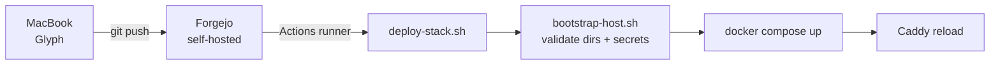
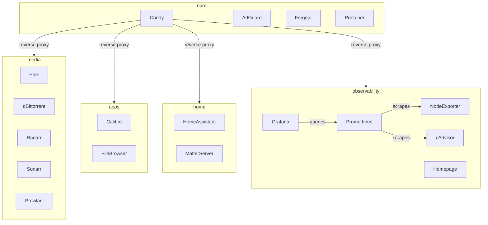
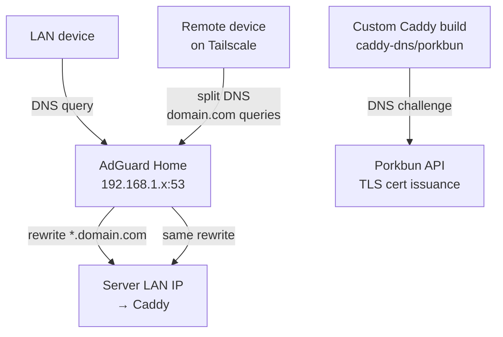

# homelab

GitOps-managed homelab infrastructure. All services run as Docker Compose stacks on a single Ubuntu server, deployed automatically via a self-hosted Forgejo CI/CD pipeline.

**Server specs:** Ryzen 7 5700x · RTX 3070 (Plex GPU transcoding) · 84GB RAM

---

## How it works

Push to `main` → Forgejo Actions picks up the change → runner on the server executes `deploy-stack.sh <stack>` → Docker Compose applies the diff.

No SSH required for normal operations. Config files are bind-mounted read-only from the repo into containers, so the repo is always the source of truth.



---

## Stacks

| Stack | Services |
|-------|----------|
| `core` | Caddy (reverse proxy + TLS), AdGuard Home (DNS), Forgejo, Portainer |
| `media` | Plex, qBittorrent, Radarr, Sonarr, Prowlarr, FlareSolverr |
| `apps` | Calibre, FileBrowser |
| `home` | Home Assistant, Matter Server |
| `observability` | Prometheus, Grafana, Node Exporter, cAdvisor, Homepage |



---

## Architecture highlights

### Reverse proxy + TLS
Caddy runs with `network_mode: host` and handles TLS for all subdomains via the **Porkbun DNS challenge** (custom-built Caddy binary with the `caddy-dns/porkbun` plugin). No ports are exposed to the internet — TLS certs are issued entirely via DNS.

### DNS: split-horizon with AdGuard + Tailscale



- **LAN**: Router DHCP points to AdGuard. AdGuard rewrites `*.yourdomain.com → server LAN IP` so local devices always hit Caddy directly.
- **Remote (Tailscale)**: Tailscale split DNS routes `yourdomain.com` queries to AdGuard via the server's Tailscale IP. Same resolution, no public exposure.
- **Result**: Everything works identically on LAN and Tailscale with a single Caddyfile and real TLS certs everywhere.

### Secrets
Never committed. Live at `/opt/homelab/secrets/` on the server. Example files are in `infra/secrets/examples/`. `bootstrap-host.sh` creates required directories and `deploy-stack.sh` validates stack-specific secrets before any deploy proceeds.

### CI/CD
Each stack has its own Forgejo Actions workflow that watches its own path set — changing `infra/docker/compose/core/**` only triggers the core deploy, not everything. The deploy script force-recreates the Caddy container on every core deploy to avoid Docker's file bind-mount inode caching issue with git pulls.

---

## Repo layout

```
infra/
├── docker/
│   ├── compose/          # one directory per stack
│   └── config/           # bind-mounted config files (Caddyfile, prometheus.yml, etc.)
├── scripts/
│   ├── bootstrap-host.sh # ensures required host dirs exist
│   └── deploy-stack.sh   # called by CI; validates secrets, runs docker compose up
├── secrets/
│   └── examples/         # .env.example files — copy to /opt/homelab/secrets/ and fill in
└── .forgejo/workflows/   # one workflow file per stack
```

---

## Adapting this for your own setup

1. Replace domain references (`anthonykubeka.com`) with your own domain
2. Replace DNS provider plugin in the Caddy build if you're not using Porkbun
3. Copy `infra/secrets/examples/` files to `/opt/homelab/secrets/` on your server and fill in real values
4. Run `infra/scripts/bootstrap-host.sh` to create required directories
5. Set up a Forgejo (or Gitea) instance with a runner on your server, or adapt the workflow files for GitHub Actions
