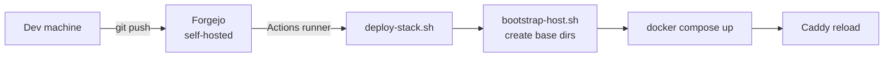
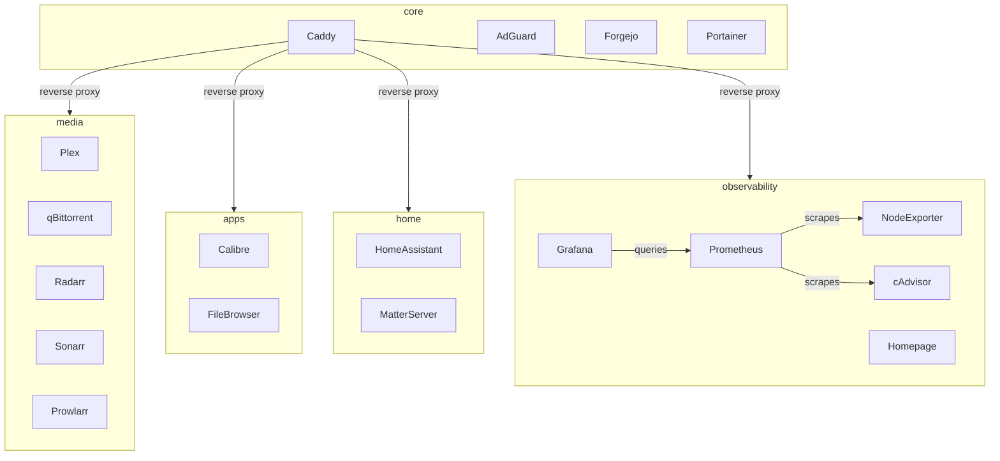
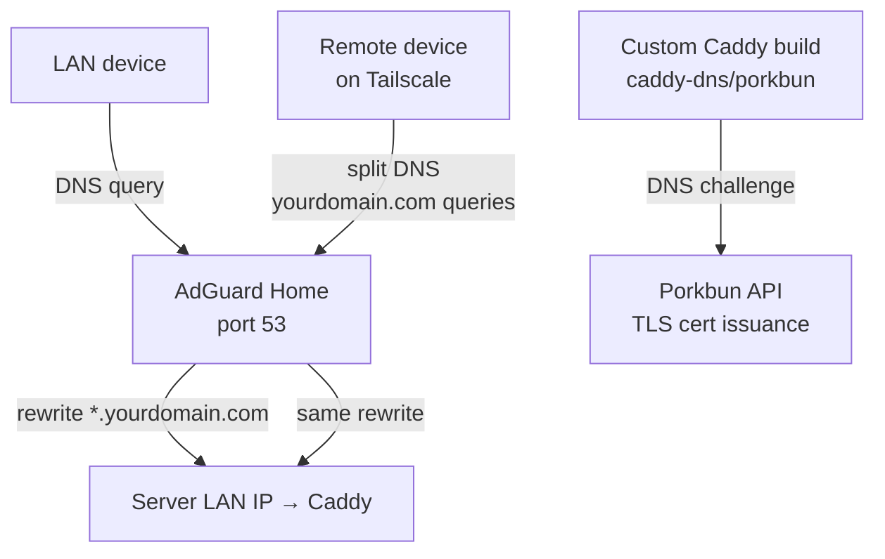

# homelab

GitOps-managed homelab infrastructure. All services run as Docker Compose stacks on a single Ubuntu server, deployed automatically via a self-hosted Forgejo CI/CD pipeline.

Push to `main` → Forgejo Actions picks up the change → runner on the server executes `deploy-stack.sh <stack>` → Docker Compose applies the diff. No SSH required for normal operations. Config files are bind-mounted read-only from the repo, so the repo is always the source of truth.



---

## Stacks

Each stack is independently deployable. `core` is the only required one — all others are optional and can be added or skipped freely.

| Stack | Services | Required? |
|-------|----------|-----------|
| `core` | Caddy (reverse proxy + TLS), AdGuard Home (DNS), Forgejo, Portainer | Yes |
| `observability` | Prometheus, Grafana, Node Exporter, cAdvisor, Homepage | No |
| `media` | Plex (optional GPU), qBittorrent, Radarr, Sonarr, Prowlarr, FlareSolverr | No |
| `apps` | Calibre, FileBrowser | No |
| `home` | Home Assistant, Matter Server | No |



---

## Architecture highlights

### Reverse proxy + TLS
Caddy runs with `network_mode: host` and handles TLS for all subdomains via a **DNS challenge** (custom-built Caddy binary with a `caddy-dns/<provider>` plugin). No ports are exposed to the internet — TLS certs are issued entirely via DNS. The domain is set once as `HOMELAB_DOMAIN=yourdomain.com` in `caddy.env` and referenced everywhere in the Caddyfile as `{$HOMELAB_DOMAIN}`. The repo uses Porkbun as the DNS provider but any provider with a Caddy plugin works.

### DNS: split-horizon with AdGuard + Tailscale



- **LAN**: Router DHCP points to AdGuard. AdGuard rewrites `*.yourdomain.com → server LAN IP` so local devices always hit Caddy directly.
- **Remote (Tailscale)**: Tailscale split DNS routes `yourdomain.com` queries to AdGuard via the server's Tailscale IP. Same resolution, no public exposure.
- **Result**: Everything works identically on LAN and Tailscale with a single Caddyfile and real TLS certs everywhere.

### Secrets
Never committed. Live at `/opt/homelab/secrets/` on the server. Example files are in `infra/secrets/examples/`. `deploy-stack.sh` validates stack-specific secrets exist and creates that stack's data directories before deploying.

---

## Installation

### Prerequisites
- Ubuntu server (or any systemd-based Linux)
- A domain with Porkbun DNS (or adapt the Caddy build for your DNS provider)
- A Forgejo instance with an Actions runner on the server — can be self-hosted via the `core` stack itself

---

### Core (required)

#### 0. Install prerequisites

```bash
sudo apt update && sudo apt install -y git curl
```

#### 1. Install Docker

```bash
curl -fsSL https://get.docker.com | sudo sh
sudo usermod -aG docker $USER
newgrp docker  # activates the group for the current shell; log out and back in to make it permanent
```

#### 2. Clone the repo

```bash
sudo mkdir -p /opt/homelab && sudo chown $USER:$USER /opt/homelab
git clone https://github.com/AnthonyKubeka/homelab.git /opt/homelab/repo
cd /opt/homelab/repo
```

#### 3. Run setup

```bash
bash infra/scripts/setup.sh
```

Creates the base directory structure and copies example secrets into place.

#### 4. Fill in secrets

```bash
nano /opt/homelab/secrets/core/caddy.env
```
Set `PORKBUN_API_KEY`, `PORKBUN_API_SECRET`, and `HOMELAB_DOMAIN` (your root domain, e.g. `yourdomain.com`).

```bash
nano /opt/homelab/secrets/core/forgejo.env
```
Replace `yourdomain.com` in all three `FORGEJO__server__*` vars. Set `USER_UID` and `USER_GID` to match your user — run `id` to check.

#### 5. Build the custom Caddy binary

Caddy needs a DNS provider plugin compiled in for the DNS challenge. This repo uses Porkbun — replace `caddy-dns/porkbun` with your provider if different. Full list: https://caddyserver.com/docs/modules/dns.providers

```bash
# Ubuntu 22.04's apt golang is too old for xcaddy — install via snap instead
sudo snap install go --classic

go install github.com/caddyserver/xcaddy/cmd/xcaddy@latest
export PATH=$PATH:$(go env GOPATH)/bin
echo 'export PATH=$PATH:$(go env GOPATH)/bin' >> ~/.bashrc

# Replace caddy-dns/porkbun with your DNS provider's plugin
# This takes a few minutes on first run
xcaddy build \
  --with github.com/caddy-dns/porkbun \
  --output /opt/homelab/caddy/caddy

# Dockerfile so Docker Compose can build the image
cat > /opt/homelab/caddy/Dockerfile <<'EOF'
FROM ubuntu:22.04
COPY caddy /usr/bin/caddy
ENTRYPOINT ["/usr/bin/caddy"]
EOF
```

If you switch providers, also update the `(dns_tls)` snippet in `infra/docker/config/caddy/Caddyfile` and the corresponding env vars in `caddy.env`.

#### 6. Trim the Caddyfile

Caddy issues TLS certs for every subdomain defined. Remove blocks for stacks you won't deploy — each block is labelled with its stack in a comment:

```bash
nano infra/docker/config/caddy/Caddyfile
```

Keep the `(dns_tls)` snippet and all `# stack: core` blocks. Remove anything else you don't need.

#### 7. Deploy core

```bash
REPO_ROOT=/opt/homelab/repo /opt/homelab/repo/infra/scripts/deploy-stack.sh core
```

#### 8. Configure AdGuard

Ubuntu's `systemd-resolved` holds port 53 by default, which blocks AdGuard from binding. Fix it first:

```bash
echo "DNSStubListener=no" | sudo tee -a /etc/systemd/resolved.conf
sudo systemctl restart systemd-resolved
```

Then open the AdGuard UI at `http://server-lan-ip:3002`:
- **Filters → DNS rewrites**: `*.yourdomain.com` → server LAN IP
- **Settings → DNS settings**: upstream DNS set to `https://dns.cloudflare.com/dns-query`

Point your router's DHCP DNS server at the server's LAN IP.

#### 9. Set up the Forgejo Actions runner

CI/CD requires a runner registered against your Forgejo instance. After Forgejo is up:

1. Create an admin account at `https://forgejo.yourdomain.com`
2. Go to **Site Administration → Actions → Runners** and create a new runner token
3. Install and register the runner on the server — see [Forgejo runner docs](https://forgejo.org/docs/latest/admin/actions/)

Until the runner is registered, pushes to `main` won't trigger deploys. You can still deploy manually with `deploy-stack.sh`.

---

### Observability (optional)

```bash
nano /opt/homelab/secrets/observability/grafana.env  # set admin password
REPO_ROOT=/opt/homelab/repo /opt/homelab/repo/infra/scripts/deploy-stack.sh observability
```

Grafana available at `https://grafana.yourdomain.com`. Prometheus scrapes Node Exporter and cAdvisor automatically.

---

### Media (optional)

Update volume mounts to point at your drives:

```bash
nano /opt/homelab/repo/infra/docker/compose/media/docker-compose.yml
# Set /mnt/media and /mnt/torrents to your actual mount points
```

If you have an NVIDIA GPU for Plex transcoding, ensure the NVIDIA Container Toolkit is installed. Otherwise remove the `runtime: nvidia` and `deploy.resources` block from the Plex service.

```bash
REPO_ROOT=/opt/homelab/repo /opt/homelab/repo/infra/scripts/deploy-stack.sh media
```

---

### Apps (optional)

```bash
# Optionally update the Calibre books path in docker-compose.yml
nano /opt/homelab/repo/infra/docker/compose/apps/docker-compose.yml

REPO_ROOT=/opt/homelab/repo /opt/homelab/repo/infra/scripts/deploy-stack.sh apps
```

---

### Home (optional)

Update the Zigbee dongle device path and HA external URL:

```bash
nano /opt/homelab/repo/infra/docker/compose/home/docker-compose.yml     # update device path
nano /opt/homelab/repo/infra/docker/config/homeassistant/configuration.yaml  # update external_url
```

```bash
REPO_ROOT=/opt/homelab/repo /opt/homelab/repo/infra/scripts/deploy-stack.sh home
```

---

### Remote access via Tailscale (optional)

Install Tailscale on the server, then configure split DNS in the Tailscale admin console:
- **DNS → Nameservers**: add the server's Tailscale IP, restricted to `yourdomain.com`

Point your Porkbun A records to the server's Tailscale IP. Remote clients on Tailscale will resolve `*.yourdomain.com` via AdGuard and route through Tailscale — no port forwarding needed.

---

## Repo layout

```
infra/
├── docker/
│   ├── compose/          # one directory per stack
│   └── config/           # bind-mounted config files (Caddyfile, prometheus.yml, etc.)
├── scripts/
│   ├── setup.sh          # run once on a fresh host
│   ├── bootstrap-host.sh # run on every deploy — ensures base dirs exist
│   └── deploy-stack.sh   # called by CI; creates stack dirs, validates secrets, deploys
├── secrets/
│   └── examples/         # .env.example files copied by setup.sh
└── .forgejo/workflows/   # one workflow file per stack
```
