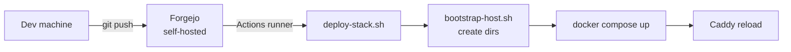
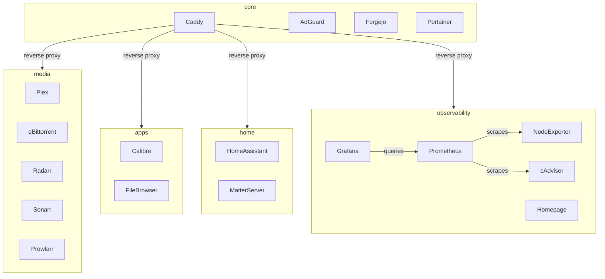
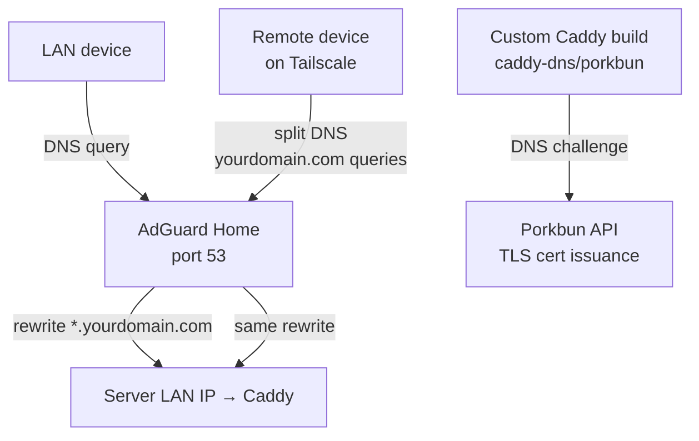

# homelab

GitOps-managed homelab infrastructure. All services run as Docker Compose stacks on a single Ubuntu server, deployed automatically via a self-hosted Forgejo CI/CD pipeline.

Push to `main` → Forgejo Actions picks up the change → runner on the server executes `deploy-stack.sh <stack>` → Docker Compose applies the diff. No SSH required for normal operations. Config files are bind-mounted read-only from the repo, so the repo is always the source of truth.



---

## Stacks

| Stack | Services |
|-------|----------|
| `core` | Caddy (reverse proxy + TLS), AdGuard Home (DNS), Forgejo, Portainer |
| `media` | Plex (optional GPU), qBittorrent, Radarr, Sonarr, Prowlarr, FlareSolverr |
| `apps` | Calibre, FileBrowser |
| `home` | Home Assistant, Matter Server |
| `observability` | Prometheus, Grafana, Node Exporter, cAdvisor, Homepage |



---

## Architecture highlights

### Reverse proxy + TLS
Caddy runs with `network_mode: host` and handles TLS for all subdomains via the **Porkbun DNS challenge** (custom-built Caddy binary with the `caddy-dns/porkbun` plugin). No ports are exposed to the internet — TLS certs are issued entirely via DNS. The domain is configured once in `caddy.env` as `HOMELAB_DOMAIN=yourdomain.com` and referenced throughout the Caddyfile as `{$HOMELAB_DOMAIN}`.

### DNS: split-horizon with AdGuard + Tailscale



- **LAN**: Router DHCP points to AdGuard. AdGuard rewrites `*.yourdomain.com → server LAN IP` so local devices always hit Caddy directly.
- **Remote (Tailscale)**: Tailscale split DNS routes `yourdomain.com` queries to AdGuard via the server's Tailscale IP. Same resolution, no public exposure.
- **Result**: Everything works identically on LAN and Tailscale with a single Caddyfile and real TLS certs everywhere.

### Secrets
Never committed. Live at `/opt/homelab/secrets/` on the server. Example files are in `infra/secrets/examples/`. `deploy-stack.sh` validates stack-specific secrets exist before any deploy proceeds.

### CI/CD
Each stack has its own Forgejo Actions workflow that watches its own path set — changing `infra/docker/compose/core/**` only triggers the core deploy, not everything. The deploy script force-recreates the Caddy container on every core deploy to avoid Docker's file bind-mount inode caching issue with git pulls.

---

## Fresh install

### Prerequisites
- Ubuntu server (or any systemd-based Linux)
- Docker + Docker Compose plugin installed
- Tailscale installed on the host
- A domain with Porkbun DNS (or adapt the Caddy build for your DNS provider)
- A Forgejo instance with an Actions runner registered on the server (can be self-hosted on the same machine using the `core` stack)

### 1. Clone the repo

```bash
sudo mkdir -p /opt/homelab
sudo chown $USER:$USER /opt/homelab
git clone https://github.com/AnthonyKubeka/homelab.git /opt/homelab/repo
cd /opt/homelab/repo
```

### 2. Run setup

```bash
bash infra/scripts/setup.sh
```

This creates all required directories under `/opt/homelab/` and copies example secrets files into place.

### 3. Fill in your secrets

```bash
nano /opt/homelab/secrets/core/caddy.env           # Porkbun API keys + HOMELAB_DOMAIN
nano /opt/homelab/secrets/core/forgejo.env          # Forgejo domain config
nano /opt/homelab/secrets/observability/grafana.env # Grafana admin password
```

### 4. Build the custom Caddy binary

Caddy needs the `caddy-dns/porkbun` plugin compiled in. On the server:

```bash
sudo apt install golang -y
go install github.com/caddyserver/xcaddy/cmd/xcaddy@latest
mkdir -p /opt/homelab/caddy
xcaddy build --with github.com/caddy-dns/porkbun --output /opt/homelab/caddy/caddy

# Create a minimal Dockerfile so Docker Compose can build the image
cat > /opt/homelab/caddy/Dockerfile <<'EOF'
FROM scratch
COPY caddy /usr/bin/caddy
ENTRYPOINT ["/usr/bin/caddy"]
EOF
```

### 5. Configure media paths

Edit `infra/docker/compose/media/docker-compose.yml` and update the volume mounts to point at your actual drives:

```yaml
- /mnt/media:/media       # your media drive
- /mnt/torrents:/torrents # your downloads drive
```

### 6. Configure your Zigbee dongle (home stack)

Edit `infra/docker/compose/home/docker-compose.yml` and update the device path to match your Zigbee USB dongle:

```yaml
devices:
  - /dev/serial/by-id/YOUR_DONGLE_ID:/dev/ttyZigbee
```

### 7. Deploy

Push to `main` to trigger Forgejo Actions, or deploy manually:

```bash
REPO_ROOT=/opt/homelab/repo /opt/homelab/repo/infra/scripts/deploy-stack.sh core
REPO_ROOT=/opt/homelab/repo /opt/homelab/repo/infra/scripts/deploy-stack.sh observability
# etc.
```

### 8. Configure AdGuard DNS rewrites

In the AdGuard UI (`http://server-lan-ip:3002`):
- **Filters → DNS rewrites**: add `*.yourdomain.com → server LAN IP`
- **Settings → DNS settings**: set upstream DNS to `https://dns.cloudflare.com/dns-query`

Point your router's DHCP DNS server at the server's LAN IP.

### 9. Configure Tailscale split DNS

In the Tailscale admin console:
- **DNS → Nameservers**: add the server's Tailscale IP, restricted to `yourdomain.com`

---

## Repo layout

```
infra/
├── docker/
│   ├── compose/          # one directory per stack
│   └── config/           # bind-mounted config files (Caddyfile, prometheus.yml, etc.)
├── scripts/
│   ├── setup.sh          # run once on a fresh host — creates dirs and copies secrets
│   ├── bootstrap-host.sh # run on every deploy — ensures dirs exist
│   └── deploy-stack.sh   # called by CI; validates secrets, runs docker compose up
├── secrets/
│   └── examples/         # .env.example files copied by setup.sh
└── .forgejo/workflows/   # one workflow file per stack
```
