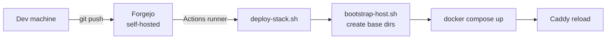
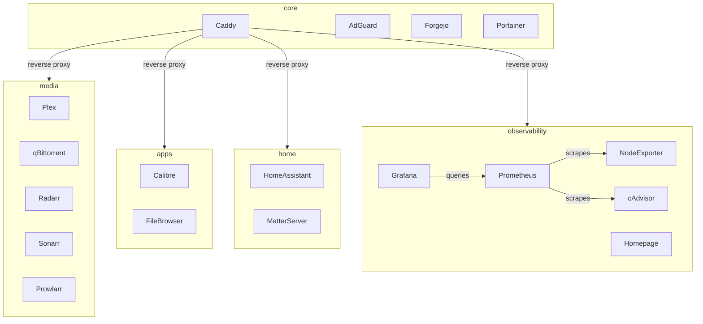
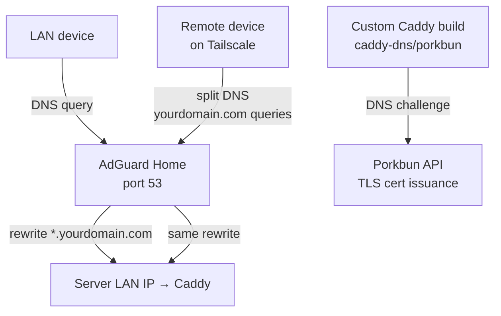

# homelab

GitOps-managed homelab infrastructure. All services run as Docker Compose stacks on a single Ubuntu server, deployed automatically via a self-hosted Forgejo CI/CD pipeline.

Push to `main` → Forgejo Actions picks up the change → runner on the server executes `deploy-stack.sh <stack>` → Docker Compose applies the diff. No SSH required for normal operations. Config files are bind-mounted read-only from the repo, so the repo is always the source of truth.



---

## Stacks

Each stack is independently deployable. `core` is the only required one — all others are optional and can be added or skipped freely.

| Stack | Services | Required? |
|-------|----------|-----------|
| `core` | Caddy (reverse proxy + TLS), AdGuard Home (DNS), Forgejo, Portainer | Yes |
| `observability` | Prometheus, Grafana, Node Exporter, cAdvisor, Homepage | No |
| `media` | Plex (optional GPU), qBittorrent, Radarr, Sonarr, Prowlarr, FlareSolverr | No |
| `apps` | Calibre, FileBrowser | No |
| `home` | Home Assistant, Matter Server | No |



---

## Architecture highlights

### Reverse proxy + TLS
Caddy runs with `network_mode: host` and handles TLS for all subdomains via a **DNS challenge** (custom-built Caddy binary with a `caddy-dns/<provider>` plugin). No ports are exposed to the internet — TLS certs are issued entirely via DNS. The domain is set once as `HOMELAB_DOMAIN=yourdomain.com` in `caddy.env` and referenced everywhere in the Caddyfile as `{$HOMELAB_DOMAIN}`. The repo uses Porkbun as the DNS provider but any provider with a Caddy plugin works.

### DNS: split-horizon with AdGuard + Tailscale



- **LAN**: Router DHCP points to AdGuard. AdGuard rewrites `*.yourdomain.com → server LAN IP` so local devices always hit Caddy directly.
- **Remote (Tailscale)**: Tailscale split DNS routes `yourdomain.com` queries to AdGuard via the server's Tailscale IP. Same resolution, no public exposure.
- **Result**: Everything works identically on LAN and Tailscale with a single Caddyfile and real TLS certs everywhere.

### Secrets
Never committed. Live at `/opt/homelab/secrets/` on the server. Example files are in `infra/secrets/examples/`. `deploy-stack.sh` validates stack-specific secrets exist and creates that stack's data directories before deploying.

---

## Installation

### Prerequisites
- Ubuntu server (22.04+)
- A domain managed via Porkbun DNS (or adapt for another provider — see below)
- Git installed on the server (`sudo apt install -y git`)

---

### 1. Clone the repo

```bash
git clone https://github.com/AnthonyKubeka/homelab.git /opt/homelab/repo
cd /opt/homelab/repo
```

### 2. Run setup

```bash
bash infra/scripts/setup.sh
```

The script is interactive and handles everything:

- Installs Docker and prerequisites
- Prompts for your domain, Porkbun API credentials, and which stacks to deploy
- Configures all secret files
- Patches compose files with your paths, timezone, and hardware config
- Trims the Caddyfile to only the stacks you're deploying
- Builds the custom Caddy binary (with DNS plugin)
- Frees port 53 from `systemd-resolved` for AdGuard
- Deploys all selected stacks

When it finishes it prints exact instructions for the three remaining steps that require external access:

1. **AdGuard** — configure DNS rewrites and upstream DNS via the web UI (`http://server-ip:3002`)
2. **DNS** — add a wildcard A record in Porkbun pointing to your server IP
3. **Forgejo runner** — register an Actions runner for CI/CD

---

### Changing DNS provider

This repo defaults to Porkbun. To use a different provider:

1. Update the `(dns_tls)` snippet in `infra/docker/config/caddy/Caddyfile` to your provider's syntax
2. Update env var names in `caddy.env` to match your provider
3. Rebuild Caddy: `xcaddy build --with github.com/caddy-dns/<provider> --output /opt/homelab/caddy/caddy`

Full provider list: https://caddyserver.com/docs/modules/dns.providers

---

### Remote access via Tailscale (optional)

Install Tailscale on the server, then configure split DNS in the Tailscale admin console:
- **DNS → Nameservers**: add the server's Tailscale IP, restricted to `yourdomain.com`

Point your Porkbun A record to the server's Tailscale IP. Remote clients on Tailscale resolve `*.yourdomain.com` via AdGuard and route through Tailscale — no port forwarding needed.

---

## Repo layout

```
infra/
├── docker/
│   ├── compose/          # one directory per stack
│   └── config/           # bind-mounted config files (Caddyfile, prometheus.yml, etc.)
├── scripts/
│   ├── setup.sh          # run once on a fresh host
│   ├── bootstrap-host.sh # run on every deploy — ensures base dirs exist
│   └── deploy-stack.sh   # called by CI; creates stack dirs, validates secrets, deploys
├── secrets/
│   └── examples/         # .env.example files copied by setup.sh
└── .forgejo/workflows/   # one workflow file per stack
```
