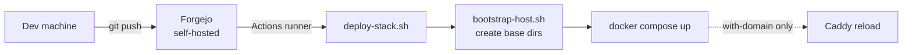
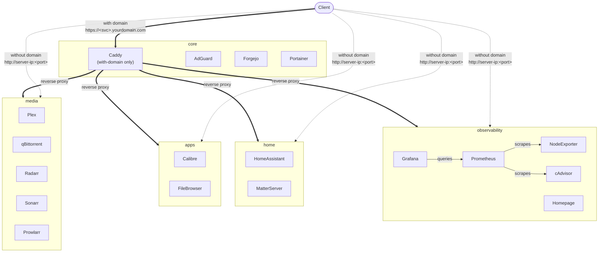
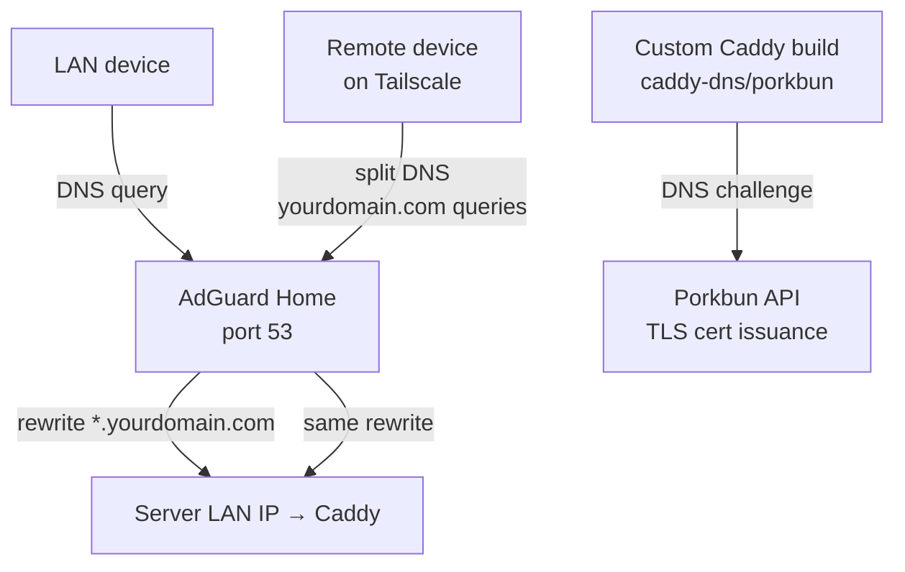

# homelab

GitOps-managed homelab infrastructure. All services run as Docker Compose stacks on a single Ubuntu server, deployed automatically via a self-hosted Forgejo CI/CD pipeline.

Push to `main` → Forgejo Actions picks up the change → runner on the server executes `deploy-stack.sh <stack>` → Docker Compose applies the diff. No SSH required for normal operations. Config files are bind-mounted read-only from the repo, so the repo is always the source of truth.


```mermaid
flowchart LR
    dev[Dev machine] -->|git push| forgejo[Forgejo\nself-hosted]
    forgejo -->|Actions runner| deploy[deploy-stack.sh]
    deploy --> bootstrap[bootstrap-host.sh\ncreate base dirs]
    bootstrap --> compose[docker compose up]
    compose -.->|with-domain only| caddy[Caddy reload]
```

---

## Stacks

Each stack is independently deployable. `core` is the only required one — all others are optional and can be added or skipped freely.

| Stack | Services | Required? |
|-------|----------|-----------|
| `core` | Caddy (reverse proxy + TLS — only if you set up with a domain), AdGuard Home (DNS), Forgejo, Portainer | Yes |
| `observability` | Prometheus, Grafana, Node Exporter, cAdvisor, Homepage | No |
| `media` | Plex (optional GPU), qBittorrent, Radarr, Sonarr, Prowlarr, FlareSolverr | No |
| `apps` | Calibre, FileBrowser | No |
| `home` | Home Assistant, Matter Server | No |


```mermaid
graph TD
    client([Client])

    subgraph core
        Caddy["Caddy<br/>(with-domain only)"]
        AdGuard
        Forgejo
        Portainer
    end
    subgraph media
        Plex
        qBittorrent
        Radarr
        Sonarr
        Prowlarr
    end
    subgraph apps
        Calibre
        FileBrowser
    end
    subgraph home
        HomeAssistant
        MatterServer
    end
    subgraph observability
        Prometheus
        Grafana
        NodeExporter
        cAdvisor
        Homepage
    end

    client ==>|"with domain<br/>https://&lt;svc&gt;.yourdomain.com"| Caddy
    Caddy ==>|reverse proxy| media
    Caddy ==>|reverse proxy| apps
    Caddy ==>|reverse proxy| home
    Caddy ==>|reverse proxy| observability

    client -.->|"without domain<br/>http://server-ip:&lt;port&gt;"| media
    client -.->|"without domain<br/>http://server-ip:&lt;port&gt;"| apps
    client -.->|"without domain<br/>http://server-ip:&lt;port&gt;"| home
    client -.->|"without domain<br/>http://server-ip:&lt;port&gt;"| observability

    Prometheus -->|scrapes| NodeExporter
    Prometheus -->|scrapes| cAdvisor
    Grafana -->|queries| Prometheus
```

> **Reading the diagram:** thick solid arrows are the **with-domain** path (clients → Caddy → backing service). Dashed arrows are the **without-domain** path (clients hit each service directly on its host port; Caddy is not deployed).

---

## Architecture highlights

> The reverse-proxy, TLS, and split-DNS topology below describes the **with-domain** install path. If you set up without a domain (see [Installation](#installation)), Caddy is not deployed and services are reached directly at `http://server-ip:<port>`.

### Reverse proxy + TLS
Caddy runs with `network_mode: host` and handles TLS for all subdomains via a **DNS challenge** (custom-built Caddy binary with a `caddy-dns/<provider>` plugin). No ports are exposed to the internet — TLS certs are issued entirely via DNS. The domain is set once as `HOMELAB_DOMAIN=yourdomain.com` in `caddy.env` and referenced everywhere in the Caddyfile as `{$HOMELAB_DOMAIN}`. The repo uses Porkbun as the DNS provider but any provider with a Caddy plugin works.

### DNS: split-horizon with AdGuard + Tailscale


```mermaid
flowchart TD
    lan[LAN device] -->|DNS query| adguard[AdGuard Home\nport 53]
    adguard -->|rewrite *.yourdomain.com| server_lan[Server LAN IP → Caddy]

    remote[Remote device\non Tailscale] -->|split DNS\nyourdomain.com queries| adguard
    adguard -->|same rewrite| server_lan

    caddy_build[Custom Caddy build\ncaddy-dns/porkbun] -->|DNS challenge| porkbun[Porkbun API\nTLS cert issuance]
```

- **LAN**: Router DHCP points to AdGuard. AdGuard rewrites `*.yourdomain.com → server LAN IP` so local devices always hit Caddy directly.
- **Remote (Tailscale)**: Tailscale split DNS routes `yourdomain.com` queries to AdGuard via the server's Tailscale IP. Same resolution, no public exposure.
- **Result**: Everything works identically on LAN and Tailscale with a single Caddyfile and real TLS certs everywhere.

### Secrets
Never committed. Live at `/opt/homelab/secrets/` on the server. Example files are in `infra/secrets/examples/`. `deploy-stack.sh` validates stack-specific secrets exist and creates that stack's data directories before deploying.

---

## Installation

Two paths are supported:

- **With a domain** — full setup with Caddy reverse-proxy, TLS via Let's Encrypt, and clean URLs like `https://adguard.yourdomain.com`. Recommended.
- **Without a domain** — quick start. Caddy is skipped entirely and each service is reached directly at `http://server-ip:<port>`. Useful if you don't have a domain yet, or just want to try things out.

You choose the path at the first prompt of `setup.sh` (entering a domain or pressing Enter to skip).

### Prerequisites
- Ubuntu server (22.04+)
- Git installed on the server (`sudo apt install -y git`)
- *(With-domain path only)* A domain with DNS managed via Porkbun, or another supported provider — see [Changing DNS provider](#changing-dns-provider). If you don't have one, [Cloudflare](https://www.cloudflare.com) offers free DNS management for domains purchased anywhere, and [DuckDNS](https://www.duckdns.org) provides free subdomains with no account required.

---

### 1. Clone the repo

```bash
sudo mkdir -p /opt/homelab && sudo chown $USER:$USER /opt/homelab
git clone https://github.com/AnthonyKubeka/homelab.git /opt/homelab/repo
cd /opt/homelab/repo
```

### 2. Run setup

```bash
bash infra/scripts/setup.sh
```

The script asks all questions up front, then runs end-to-end. The first prompt is for your root domain — **press Enter to skip** for the no-domain path, or enter your domain for the full setup. Both paths then prompt for which stacks to deploy and any stack-specific config (media paths, timezone, GPU, Zigbee device, Grafana password).

Common steps for both paths:

- Installs Docker and prerequisites
- Creates the `/opt/homelab` directory hierarchy
- Configures secret files
- Patches compose files with your paths, timezone, and hardware config
- Frees port 53 from `systemd-resolved` so AdGuard can use it
- Deploys all selected stacks

#### Path A: Without a domain

When you press Enter at the domain prompt, the script:

- Skips the Porkbun credentials prompt
- Skips the custom Caddy build (no `xcaddy`/Go install)
- Removes the `caddy` service from `core/docker-compose.yml` before deploying
- Rewrites domain-baked URLs in Homepage tiles, Home Assistant `external_url`, Forgejo `ROOT_URL`, and Grafana `GF_SERVER_ROOT_URL` to `http://server-ip:<port>`

When it finishes, the script prints a table of URLs in the form `http://server-ip:<port>` for every deployed service. Remaining manual steps:

1. **AdGuard** — first-time setup runs on `http://server-ip:3030` (AdGuard binds port 3000 internally on first boot until configured). Run through the wizard, accept the default Admin Web Interface port (80), and after it completes AdGuard moves to `http://server-ip:3002`. Optional: point your router's DHCP DNS at the server IP for LAN-wide ad blocking.
2. **Forgejo runner** — once Forgejo is up at `http://server-ip:3000`, register an Actions runner via Site Administration → Actions → Runners.
3. **Homepage widgets** — fill in API key placeholders in `/opt/homelab/secrets/observability/homepage.env` and redeploy observability (if installed).

#### Path B: With a domain

When you enter your domain at the prompt, the script additionally:

- Prompts for Porkbun API credentials
- Trims the Caddyfile to only the stacks you're deploying
- Builds the custom Caddy binary (with the `caddy-dns/porkbun` plugin via `xcaddy`)
- Deploys Caddy as part of the core stack

When it finishes, services are reachable at `https://<service>.yourdomain.com`. Remaining manual steps:

1. **AdGuard** — first-time setup runs on `http://server-ip:3030` (AdGuard binds port 3000 internally on first boot until configured). Run through the wizard and accept the default Admin Web Interface port (80). After it completes, AdGuard moves to `http://server-ip:3002` — open that and configure:
   - DNS rewrites: `*.yourdomain.com → server-ip`
   - Upstream DNS (e.g. `https://dns.cloudflare.com/dns-query`)
   - Then point your router's DHCP DNS at the server IP.
2. **DNS** — add a wildcard A record in Porkbun (`*.yourdomain.com → server-ip` — use your Tailscale IP if you're using Tailscale, otherwise your public IP). Once this resolves, Caddy issues TLS certs automatically.
3. **Forgejo runner** — register an Actions runner via the Forgejo UI at `https://forgejo.yourdomain.com`.
4. **Homepage widgets** — same as Path A.

---

### Changing DNS provider

This repo defaults to Porkbun. To use a different provider:

1. Update the `(dns_tls)` snippet in `infra/docker/config/caddy/Caddyfile` to your provider's syntax
2. Update env var names in `caddy.env` to match your provider
3. Rebuild Caddy: `xcaddy build --with github.com/caddy-dns/<provider> --output /opt/homelab/caddy/caddy`

Full provider list: https://caddyserver.com/docs/modules/dns.providers

---

### Remote access via Tailscale (optional)

Install Tailscale on the server, then configure split DNS in the Tailscale admin console:
- **DNS → Nameservers**: add the server's Tailscale IP, restricted to `yourdomain.com`

Point your Porkbun A record to the server's Tailscale IP. Remote clients on Tailscale resolve `*.yourdomain.com` via AdGuard and route through Tailscale — no port forwarding needed.

---

## Repo layout

```
infra/
├── docker/
│   ├── compose/          # one directory per stack
│   └── config/           # bind-mounted config files (Caddyfile, prometheus.yml, etc.)
├── scripts/
│   ├── setup.sh          # run once on a fresh host
│   ├── bootstrap-host.sh # run on every deploy — ensures base dirs exist
│   └── deploy-stack.sh   # called by CI; creates stack dirs, validates secrets, deploys
├── secrets/
│   └── examples/         # .env.example files copied by setup.sh
└── .forgejo/workflows/   # one workflow file per stack
```
